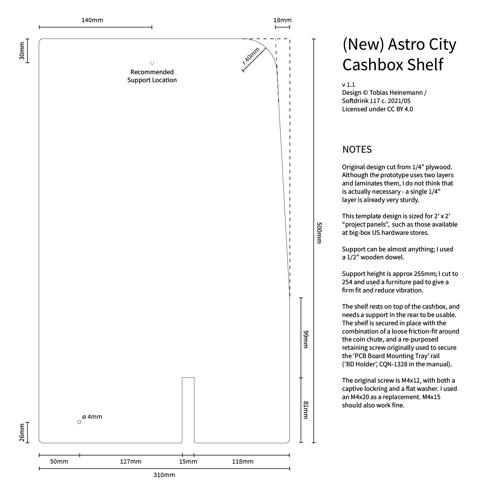

# (New) Astro City Cashbox Shelf

V1.1   
Design by Tobias Heinemann / Softdrink 117 c. 2021  
[Licensed under CC-BY](./LICENSE)

-----

This is a simple laser-cut shelf designed to mount above the cashbox in an Astro or New Astro City arcade cabinet. Contained in the repo are a dimensional drawing of the design (in [Adobe Illustrator](./dimensional_drawing/AstroCity_Shelf_V1-1_Dimensions.ai), [PDF](./dimensional_drawing/AstroCity_Shelf_V1-1_Dimensions copy.pdf), and [PNG](./dimensional_drawing/AstroCity_Shelf_V1-1_Dimensions.png) formats), ready-to-cut cutfiles of the design (in [Illustrator 8](./cutfile/AstroCity_Shelf_V1-1_CUTFILE.ai) and [PDF](./cutfile/AstroCity_Shelf_V1-1_CUTFILE copy.pdf) formats - backsaved for legacy compatibility), and a few photos of the shelf as-installed.

### Installation

First, cut the shelf from material of your choice. Though the prototype has only been tested in 1/4" plywood, the design should be usable in almost any rigid laser-cuttable material (MDF, acrylic, etc.). Cut the rear support and join it to the main shelf.

Second, remove the M4x12 screw that holds the upper edge of the 'BD Holder' (CQN-1328 in the [manual](https://wiki.arcadeotaku.com/w/File:Sega_New_Astro_City_Manual.pdf)). Then, lay the cut shelf on top of the cashbox. The slot at the front of the shelf should fit around the coin chute with just a bit of play - enough that it slides easily, but not so much that it will significantly wiggle.

Finally, use either the existing M4x12 screw, or a longer equivalent (depending on the thickness of your material) to secure the shelf in place. **It is important to make sure that you align and screw through the hole of the 'BD Holder' during reassembly.**

  
The shelf, installed for a fit test. Notice the tight but not restrictive clearance around the coin chute, and the small gaps along the side and front walls for cable management.

  
  
Additional angles showing the fit, with a Sega NAOMI system for scale. Note: These are images of the prototype, and do not include the screw or a proper rear support. There is ample space for a cabled NAOMI setup on top of the shelf, without interfering with the operation of the coin door.

The shelf is designed not to interfere with the normal 'PCB Mounting Board' tray.

Also notable in these photos is the interior illumination of the cabinet provided by my [Astro City Service Light modification](https://github.com/Softdrink117/new-astro-city-service-light-brackets).

(Please excuse the lack of final photos, I'll try to remember to add some later.)

